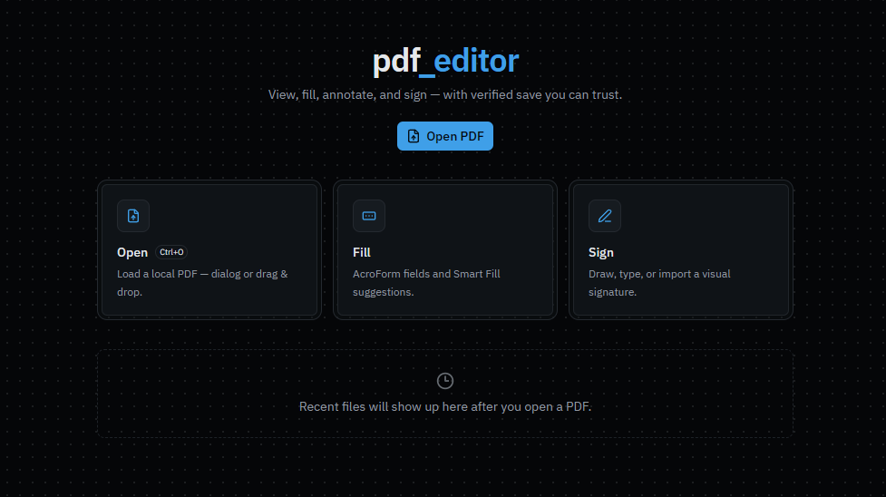
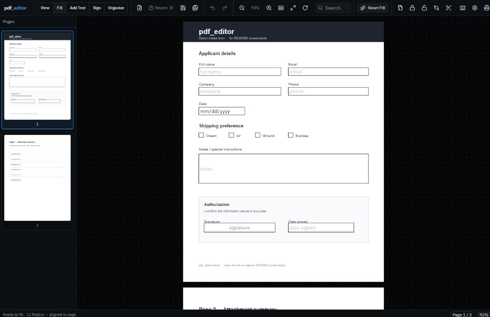
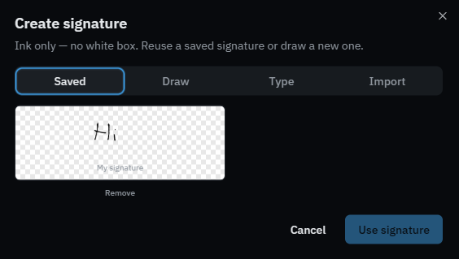
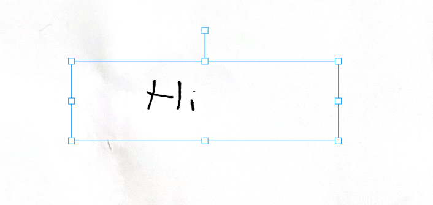
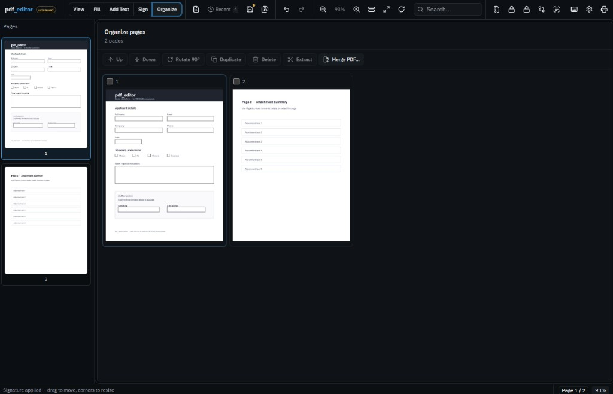

# pdf_editor

**A better Stirling PDF — fully offline desktop PDF editing.** Your files never leave your computer. No accounts, no cloud upload, no “processing on our servers.” Everything runs locally.

Inspired by tools like [Stirling-PDF](https://github.com/Stirling-Tools/Stirling-PDF) for *what* a PDF toolkit should cover — built as an original desktop app focused on **fill → sign → save reliably**, not a hosted web service.

<p align="center">
  
</p>

<p align="center">
  <a href="https://github.com/Salutatorian/the-pdf-editor/releases/latest"></a>
  
  
  
</p>

## Why pdf_editor?

| | Stirling PDF (typical) | **pdf_editor** |
|---|---|---|
| Where it runs | Often a **server / browser** you host or visit | **Native desktop** (Windows · macOS · Linux) |
| Your PDFs | Can pass through a service | **Stay on your disk only** |
| Forms & signing | Tooling-oriented | First-class **Fill · Sign · Smart Fill** |
| Saving | Export / download | **Verified save** — never says “Saved” until the file reopens cleanly |

**Privacy promise:** no telemetry cloud, no document upload, no remote storage. Autosave and drafts write next to *your* files on *your* machine.

## Download

Installers are built for all three platforms on every release:

| Platform | Artifact |
|---|---|
| **Windows** | `.exe` installer (NSIS) |
| **macOS** | `.dmg` / `.app` |
| **Linux** | `.AppImage` / `.deb` |

→ **[Latest release](https://github.com/Salutatorian/the-pdf-editor/releases/latest)**

### Already on an older version?

**You do not need to uninstall** from Control Panel / Programs and Features. Download the latest installer and run it — it upgrades in place.

- **Before 1.4.3:** one manual install of [the latest release](https://github.com/Salutatorian/the-pdf-editor/releases/latest) is required so in-app updates work correctly (older builds opened the GitHub page instead of installing).
- **1.4.3 and later:** when a new version ships, use the Update toast in the app — no redownload from GitHub.

> Builds publish automatically via GitHub Actions when a version tag (e.g. `v1.2`) is pushed. If assets are still processing, check the [Actions](https://github.com/Salutatorian/the-pdf-editor/actions) tab.

## Screenshots

### 1. Welcome (Open)
Drop a file or click **Open PDF**. Recent files stay on your machine only.


### 2. Fill forms
Jump into **Fill**, type into real AcroForm fields. Smart Fill can detect extra blanks — confirm before they stick.



### 3. Signatures (ink only, reusable)
Draw, type, or import. Transparent ink — no white box. Save signatures locally and reuse them.



### 4. Move & resize signatures
Select a signature to drag, resize, or rotate on the page.



### 5. Organize pages
Reorder, rotate, duplicate, delete, extract, merge — without leaving the app.



### 6. Add Text tools
Text, image, checkmark, date, initials, highlight, draw, shapes, redact.


### Demo PDF for your own shots
[`docs/demo-form.pdf`](docs/demo-form.pdf) — or regenerate:

```bash
node scripts/generate-demo-pdf.mjs
```

> **UI:** Ships **light mode only** (clean paper shell). Reshoot the older dark screenshots after updating if you want a fully matching gallery.

## Features

- **Open** — local files, drag-and-drop, recent files
- **View** — continuous scroll, thumbnails, zoom, fit width/page, rotate, search, print
- **Fill** — AcroForm fields, Tab navigation, Smart Fill suggestions
- **Add Text** — annotations with select / move / resize / undo
- **Sign** — draw · type · import · saved library (device-only)
- **Organize** — reorder, rotate, duplicate, delete, extract, merge
- **Save / Save As** — verified pipeline (temp → verify → replace)
- **Extras** — compress, compare, OCR assist, protect/unlock helpers

### Verified save

1. Write beside the original as a temp PDF  
2. Check non-empty + `%PDF` + structure  
3. Reopen successfully  
4. Only then replace the original  
5. On failure: original preserved + recovery copy + clear error  

Visual signatures are **appearance** signatures — not certificate/PKI digital signatures.

## Stack

React · TypeScript · Vite · Tauri 2 · PDF.js · pdf-lib · Konva · Signature Pad

## Develop

Needs Node 20+, Rust, and [Tauri prerequisites](https://v2.tauri.app/start/prerequisites/).

```bash
npm install
npm run fixture          # tiny test PDF
npm run tauri:dev        # desktop app
npm test
npm run tauri:build      # local installer for your OS
```

Cross-platform installers are produced in CI (see `.github/workflows/release.yml`).

## License

MIT
